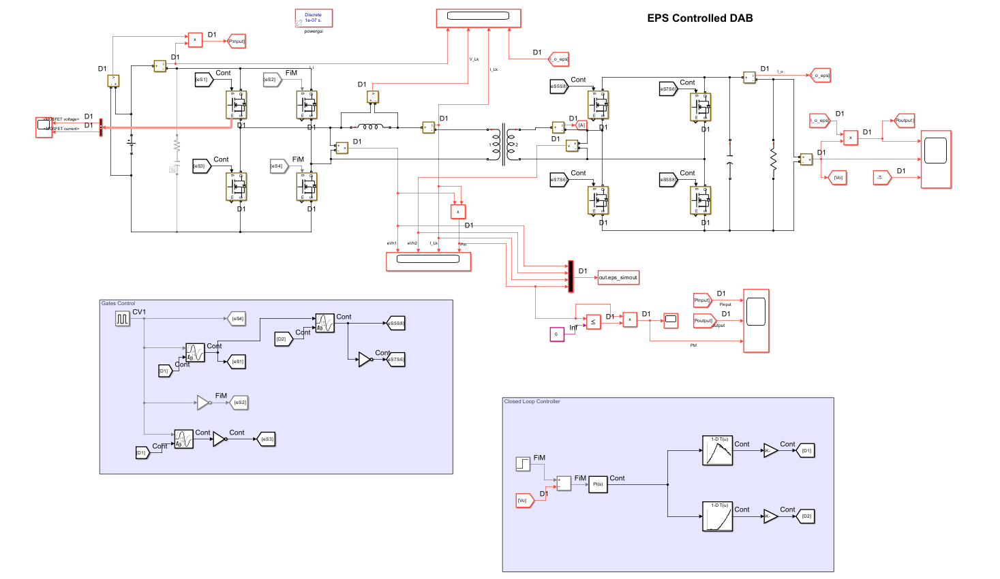
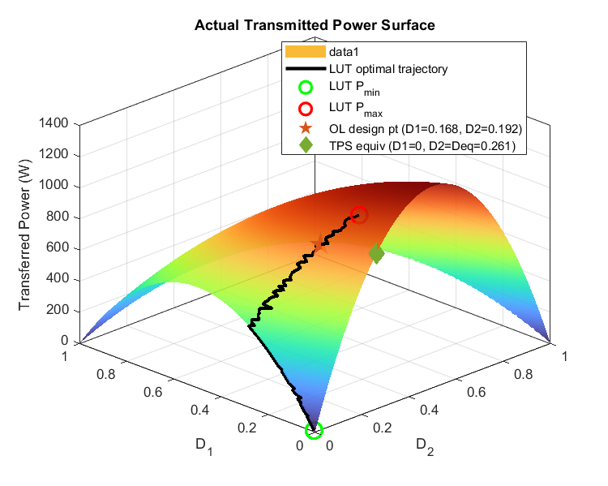

# Dual Active Bridge (DAB) — Extended Phase Shift (EPS) Control

A MATLAB/Simulink implementation of **Extended Phase Shift (EPS) modulation for a Dual Active Bridge (DAB) DC–DC converter**, combining analytical operating-point design, full D1–D2 operating-region mapping, current-stress/backflow analysis, power-to-duty look-up-table generation, and closed-loop PI control.

> **Project focus:** analytical and simulation-based evaluation of EPS modulation in buck-mode DAB operation. The present implementation does **not** claim a complete ZVS optimization framework; ZVS is intentionally outside the current control/design objective.

---

## 1. Project Overview

The Dual Active Bridge is a bidirectional isolated DC–DC converter widely used in applications such as **battery energy storage, electric vehicles, DC microgrids, and isolated charging systems**. Conventional Single Phase Shift (SPS) control is simple, but its operating point can result in unnecessary circulating current and back-power flow, particularly when the voltage conversion ratio and load condition move away from the nominal operating point.

This project investigates **Extended Phase Shift (EPS)** control, in which two independent phase-shift variables are used to shape the converter operating point:

- `D1` — internal phase shift
- `D2` — external phase shift

Rather than treating EPS only as a switching strategy, the repository develops a complete computational workflow:

```text
Converter specifications
        │
        ▼
┌─────────────────────┐
│  EPS Design         │  → optimal D1, D2, L
└─────────┬───────────┘
          ▼
┌─────────────────────┐
│  EPS Operating Map  │  → p*, G', Mbf'
└─────────┬───────────┘
          ▼
┌─────────────────────┐
│  LUT Generation     │  → P* → (D1, D2)
└─────────┬───────────┘
          ▼
┌─────────────────────┐
│  PI Control Design  │  → plant + margins
└─────────┬───────────┘
          ▼
┌─────────────────────┐
│  MATLAB/Simulink    │  → time-domain validation
└─────────────────────┘
```

The analytical formulation follows the DAB phase-shift modelling and design framework presented by Rodríguez *et al.* and is adapted here into a reusable MATLAB workflow. See **References** below.

---

## 2. Key Features

### Analytical EPS design

The design routine searches the feasible `(D1, D2)` space and selects an operating point that minimizes the peak-current-related objective

\[
J = \frac{G}{F}
\]

for the specified demanded power.

The selected operating point is then used to derive the required series/leakage inductance and associated operating quantities.

### Full D1–D2 operating-region model

The project evaluates the EPS operating region on a two-dimensional grid and calculates:

- normalized transferred power `p*`
- normalized current-stress metric `G'`
- normalized backflow-power metric `Mbf'`
- actual transmitted power `P`
- feasible EPS operating region

### Power-to-EPS look-up table

For a sweep of demanded power levels, the LUT routine searches the operating map for the `(D1, D2)` pair that provides the requested power while minimizing the current-stress metric among nearby feasible solutions.

### Closed-loop PI control

A first-order small-signal output-voltage plant is used to synthesize/evaluate a PI-controlled outer voltage loop. Gain margin, phase margin, crossover frequencies, Bode response, and closed-loop step response are evaluated.

### MATLAB/Simulink validation

The repository contains an EPS-controlled DAB Simulink model and an SPS model intended for comparative analysis.

---

## 3. Converter Configuration

The default operating point defined in `scripts/DAB_EPS_Main.m` is:

| Parameter | Symbol | Value | Unit |
|---|---:|---:|---|
| Primary DC voltage | `V1` | 220 | V |
| Secondary DC voltage | `V2` | 80 | V |
| Transformer turns ratio | `n = N1/N2` | 2 | — |
| Primary winding turns | `N1` | 220 | — |
| Secondary winding turns | `N2` | 110 | — |
| Switching frequency | `fsw` | 50 | kHz |
| Design power | `Pdes` | 1000 | W |
| Load resistance | `R` | 6 | Ω |
| Output capacitance | `C` | 220 µF | F |
| MOSFET output capacitance | `Coss` | 100 pF | F |
| Peak-current limit | `Ilim` | NaN | A |
| Grid resolution | `N` | 500 × 500 | points |

The voltage conversion ratio used by the analytical model is

\[
k = \frac{V_1}{nV_2}
\]

and the present implementation explicitly operates in **buck mode (`k > 1`)**.

> Change the values in `scripts/DAB_EPS_Main.m` to evaluate another operating point. The downstream analysis modules use the resulting `spec`, `design`, `model`, `lut`, and `ctrl` structures.

---

## 4. EPS Mathematical Model

For the forward-power buck-mode formulation used in this repository, the design stage uses

\[
F(D_1,D_2)=D_2(1-D_2)+\frac{1}{2}D_1(1-D_1-2D_2)
\]

and

\[
P=\frac{nV_1V_2}{2f_{sw}L}F(D_1,D_2).
\]

The current-stress function is represented by

\[
G(D_1,D_2)=k(1-D_1)+(2D_1+2D_2-1).
\]

For a specified design power, the inductance is obtained from

\[
L=\frac{nV_1V_2F}{2f_{sw}P_{des}}.
\]

The corresponding peak-inductor-current expression used by the design routine is

\[
I_{pk}=\frac{P_{des}}{2V_1}\frac{G}{F}.
\]

The grid model uses the normalized power expression

\[
p^*=4D_2(1-D_2)+2D_1(1-D_1-2D_2)
\]

with

\[
P=P_Np^*,
\qquad
P_N=\frac{nV_1V_2}{8f_{sw}L}.
\]

The model also evaluates normalized current stress and backflow-power surfaces across the feasible EPS region.

---

## 5. Why EPS?

SPS controls power predominantly through a single phase-shift variable. EPS adds an additional degree of freedom, allowing the same power-transfer requirement to be represented by multiple `(D1,D2)` combinations.

That additional degree of freedom can be exploited to search for operating points with reduced current stress and/or reduced backflow power.

Conceptually:

```text
                 Same demanded power
                        │
          ┌─────────────┴─────────────┐
          ▼                           ▼
      SPS operating point       Multiple EPS points
                                      │
                              ┌───────┴───────┐
                              ▼               ▼
                         Lower current    Lower backflow
                           stress            power
```

This repository therefore treats `(D1,D2)` as an **operating-point optimization problem**, rather than simply replacing the SPS duty variable with two phase-shift variables.

---

## 6. MATLAB Pipeline

The main entry point is:

```matlab
scripts/DAB_EPS_Main.m
```

Run it from the project root after adding the `scripts` directory to the MATLAB path, or change the MATLAB working directory to `scripts`.

The pipeline is:

### Stage 1 — Open-loop EPS design

```matlab
design = eps_design(spec);
```

Searches the feasible EPS region and returns the selected operating point, required inductance, peak current, backflow power, normalized quantities, and switching timing information.

### Stage 2 — D1–D2 operating map

```matlab
model = eps_model(spec, design);
```

Builds the full `D1 × D2` grid and evaluates the power, current-stress, and backflow surfaces.

### Stage 3 — LUT generation

```matlab
lut = eps_lut(spec, design, model);
```

Generates a demanded-power → `(D1,D2)` mapping using the computed operating surfaces.

### Stage 4 — PI control

```matlab
ctrl = eps_control(spec, design);
```

Builds the small-signal plant, PI controller, open-loop transfer function, closed-loop transfer function, and stability metrics.

### Stage 5 — Visualization

```matlab
eps_plots(spec, design, model, lut, ctrl);
```

Generates the analytical figures used to inspect the EPS operating region, optimal trajectory, power-transfer characteristics, current stress, backflow power, and control-loop behavior.

---

## 7. Simulink Model

The main EPS-controlled model is:

```text
models/DAB_EPS_CL_model.slx
```

A corresponding SPS model is also provided:

```text
models/DAB_SPS_CL_model.slx
```

The EPS model contains the following conceptual subsystems:

- Primary active bridge
- Series/leakage inductance
- High-frequency transformer
- Secondary active bridge
- Output capacitor and resistive load
- EPS gate-generation logic
- Closed-loop voltage controller
- Measurement and logging paths



The model logs the simulation signals used by `compare_script.m`, including bridge voltages, leakage/inductor current and input power.

---

## 8. SPS vs EPS Comparison

`compare_script.m` is provided for a direct time-domain comparison between the two Simulink models.

The comparison extracts and evaluates:

- Peak leakage/inductor current
- RMS leakage/inductor current
- Current ripple
- Average input power
- Average backflow power
- Peak backflow power
- Backflow energy
- Percentage reduction in peak current
- Percentage reduction in RMS current
- Percentage reduction in average backflow power

The comparison is intended to quantify whether the additional degree of freedom provided by EPS produces a more favorable operating trajectory than SPS for the selected operating point.

> The comparison script assumes that the corresponding Simulink models expose the expected logged signals (`eps_simout` and `sps_simout`). If the model logging configuration is changed, update the extraction section of `compare_script.m` accordingly.

---

## 9. Results

Representative generated results are stored under `results/`.

### EPS optimal control trajectory


### Actual power-transfer surface



### Normalized power-transfer surface


### Current-stress surface


### Backflow-power surface


### EPS power-regulation region


### Closed-loop control analysis


These figures are intended as **analysis outputs**, not as independent experimental validation. The current repository contains MATLAB/Simulink simulation work rather than hardware measurements.

---

## 10. Repository Structure

```text
DAB-EPS-Control/
│
├── README.md
├── LICENSE
├── .gitattributes
│
├── images/
│   └── simulinkmodeleps.png
│
├── models/
│   ├── DAB_EPS_CL_model.slx
│   ├── DAB_SPS_CL_model.slx
│   └── README.md
│
├── scripts/
│   ├── DAB_EPS_Main.m
│   ├── eps_design.m
│   ├── eps_model.m
│   ├── eps_lut.m
│   ├── eps_control.m
│   ├── eps_plots.m
│   ├── compare_script.m
│   └── README.md
│
└── results/
    ├── Actual-P-transfer-surface.png
    ├── D1D2 control trajectory.png
    ├── G(star)surface.png
    ├── Mbf(star)surface.png
    ├── p(star)surface.png
    ├── power transmission region.png
    ├── controlloop analysis.png
    ├── bridgeparameters.png
    ├── outputparameters.png
    └── README.md
```

---

## 11. Reproducibility

### MATLAB workflow

1. Clone/download the repository.
2. Open MATLAB.
3. Set the project root as the working directory.
4. Add `scripts/` to the MATLAB path.
5. Open `scripts/DAB_EPS_Main.m`.
6. Modify `spec` if required.
7. Run the script.
8. Inspect the generated command-window results and figures.

For Simulink validation:

1. Open `models/DAB_EPS_CL_model.slx`.
2. Verify that the required workspace variables are available.
3. Verify the model logging configuration.
4. Run the simulation.
5. Use `compare_script.m` if an SPS/EPS comparison is required.

### Computational note

The default grid resolution is:

```matlab
spec.N = 500;
```

This creates a dense two-dimensional operating map. Increasing `N` improves grid resolution but increases computation and memory requirements.

---

## 12. Scope and Current Limitations

This repository is deliberately focused on the EPS design/control workflow currently implemented in MATLAB/Simulink.

### Included

- Analytical EPS operating-point search
- Buck-mode DAB modelling
- D1–D2 power-transfer mapping
- Current-stress analysis
- Backflow-power analysis
- EPS power-to-duty LUT generation
- First-order small-signal voltage-loop model
- PI controller analysis
- MATLAB/Simulink closed-loop model
- SPS comparison framework

### Not yet implemented as a complete framework

- Device-level switching-loss model
- Transformer copper/core-loss model
- Semiconductor thermal model
- Detailed dead-time/nonideal switching model
- Comprehensive ZVS boundary optimization
- Hardware/experimental validation
- Automated parameter extraction from the Simulink model
- Automated export of all generated figures/data

These are potential extensions rather than assumptions about the current results.

---

## 13. Potential Extensions

Natural next steps for this project include:

1. **ZVS-aware EPS optimization** — incorporate leg-specific ZVS constraints into the operating-point search.
2. **Multi-objective optimization** — optimize current stress, backflow power, and switching-loss proxies simultaneously.
3. **Loss model integration** — add MOSFET conduction/switching losses and transformer losses.
4. **Automated LUT export** — generate controller-ready LUT files directly from MATLAB.
5. **Operating-point sweeps** — evaluate the EPS trajectory across voltage ratio and load variations.
6. **Experimental validation** — compare analytical predictions against oscilloscope/current-probe measurements.
7. **SPS/EPS benchmarking** — automate identical operating-condition comparisons over the complete load range.

---

## 14. Reference

The analytical framework used as a primary reference for the EPS/DAB operating-region analysis is:

> A. Rodríguez, A. Vázquez, D. G. Lamar, M. M. Hernando, and J. Sebastián, “Different Purpose Design Strategies and Techniques to Improve the Performance of a Dual Active Bridge With Phase-Shift Control,” *IEEE Transactions on Power Electronics*, vol. 30, no. 2, pp. 790–804, Feb. 2015. DOI: `10.1109/TPEL.2014.2309853`.

The paper develops analytical models and design approaches for DAB phase-shift operation, including operating-region and ZVS-related analysis. The implementation in this repository is an independent MATLAB/Simulink implementation and should not be considered an official reproduction of the authors' software.

---

## 15. License

This project is distributed under the license included in `LICENSE`.

If you use substantial portions of the analytical formulation or figures derived from the referenced literature, cite the original publication appropriately.

---

## Author

**Abhinav Khasariya**  
B.Tech — Sustainable Energy Engineering  
National Institute of Technology Kurukshetra
